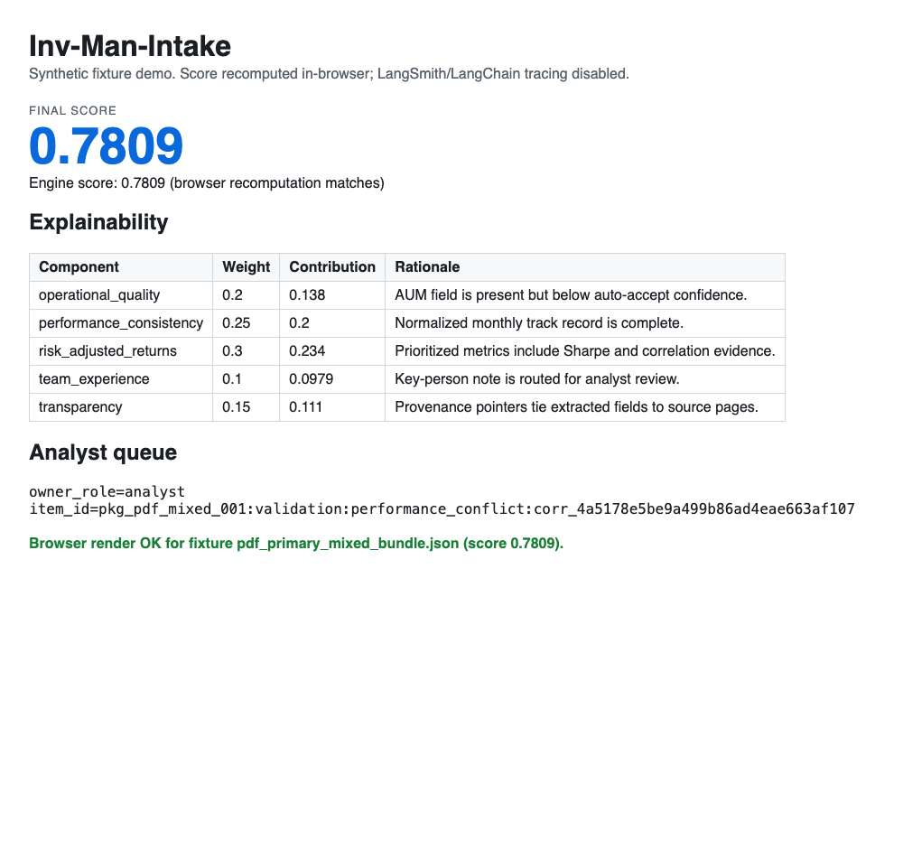

# Live Verification Gate (Browser, No Python Install)

This gate validates that the stlite browser demo is usable by a non-technical reviewer with no local Python runtime.

## Exact Open/Serve Step

Use either option:

1. Direct open: open `app/index.html` in a browser.
2. Static serve (recommended): from repository root run `python -m http.server 8000` and open `http://127.0.0.1:8000/app/index.html`.

## Reviewer Checks

1. Confirm the page loads with the `Inv-Man-Intake` title.
2. In `Synthetic intake bundle`, choose `pdf_primary_mixed_bundle.json`.
3. Confirm `Final score` is visible as `0.7809`.
4. Confirm the `Explainability` table renders one or more component rows.
5. Confirm `Analyst queue` renders `owner_role` and `item_id`.

## Screenshot Evidence


Stored screenshot artifact for PR verification after selecting `pdf_primary_mixed_bundle.json`.

## Real Headless-Browser Verification (issue #498)

The synthetic SVG above and the Python smoke test are useful supporting
evidence, but they do not prove the owner-testable browser path. This section
adds a real headless-browser verification artifact, addressing the owner
decision recorded in [#498](https://github.com/stranske/Inv-Man-Intake/issues/498)
and providing browser-rendered evidence for
[#469](https://github.com/stranske/Inv-Man-Intake/issues/469) and
[#470](https://github.com/stranske/Inv-Man-Intake/issues/470).

The verifier (`app/browser_verification.py`) runs the same deterministic
`run_v1_smoke_pipeline` the stlite demo uses, then drives a real headless
Chrome/Chromium against a self-contained, **zero-egress** page (`file://`, no
CDN). The page's JavaScript recomputes the final score in-browser by summing the
per-component contributions, so the rendered number is genuinely produced by the
browser rather than injected as static text.

### Reproduce

```bash
# Auto-detects Chrome/Chromium; override with INV_MAN_VERIFY_BROWSER=<path>.
python -m app.browser_verification --fixture pdf_primary_mixed_bundle.json
```

### Stored artifacts

- `app/artifacts/browser-verification/browser-verification.png` — real browser
  screenshot showing `Final score 0.7809` and the explainability table.
- `app/artifacts/browser-verification/browser-verification-dom.html` — DOM dump
  captured from the headless browser (`id="final-score">0.7809`,
  `data-rendered="true"`).
- `app/artifacts/browser-verification/browser-verification.log` — the command
  run, browser binary, fixture, and rendered score.


