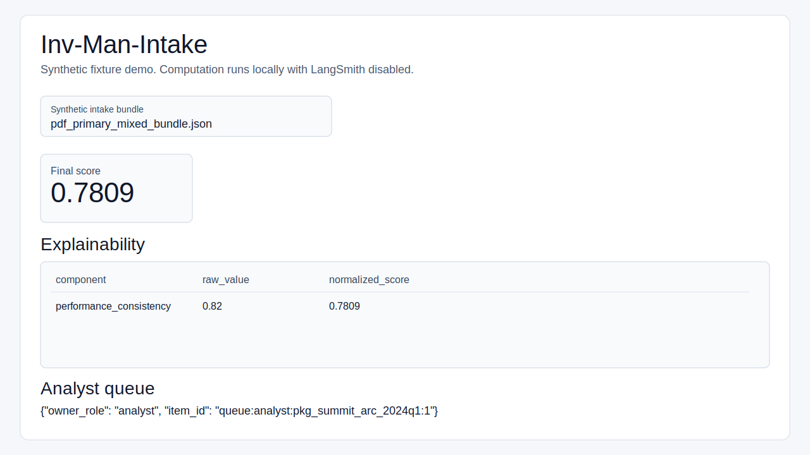

# Live Verification Gate (Browser, No Python Install)

This gate validates that the stlite browser demo is usable by a non-technical reviewer with no local Python runtime.

## Automated Browser Evidence

Run this from the repository root:

```bash
uv run --extra dev python scripts/verify_static_spa_pyodide.py --browser-channel chrome
```

The command starts a local static server, opens `app/index.html` in a real headless Chrome/Chromium browser, waits for the stlite app to render, asserts `Final score` is visible as `0.7809`, and writes durable artifacts:

- `app/live-verification-artifacts/browser-demo-score.png`
- `app/live-verification-artifacts/browser-demo-score.json`

If the host does not have system Chrome available, install Playwright's bundled Chromium and run:

```bash
uv run --extra dev python -m playwright install chromium
uv run --extra dev python scripts/verify_static_spa_pyodide.py --browser-channel ""
```

## Manual Open/Serve Step

Use either option for manual review:

1. Direct open: open `app/index.html` in a browser.
2. Static serve (recommended): from repository root run `python -m http.server 8000` and open `http://127.0.0.1:8000/app/index.html`.

## Reviewer Checks

1. Confirm the page loads with the `Inv-Man-Intake` title.
2. In `Synthetic intake bundle`, choose `pdf_primary_mixed_bundle.json`.
3. Confirm `Final score` is visible as `0.7809`.
4. Confirm the `Explainability` table renders one or more component rows.
5. Confirm `Analyst queue` renders `owner_role` and `item_id`.

## Legacy Screenshot Evidence



This SVG is retained as a static visual reference only. Source issues #469 and #470 require the automated browser evidence above because the static SVG does not prove that Pyodide/stlite rendered a numeric score in a real browser.
